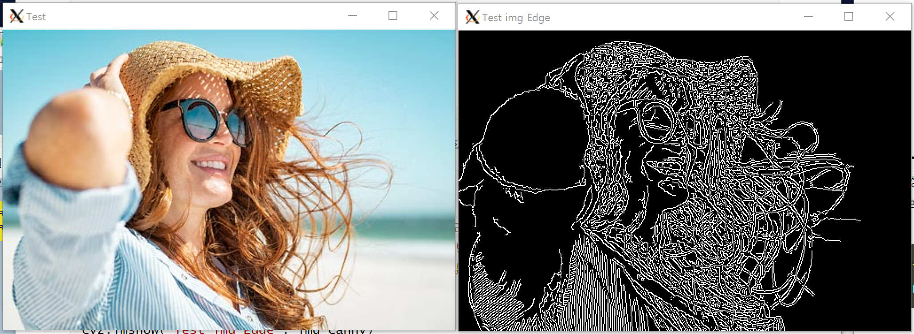

# openCV 설치 및 설정

얼굴인식 부분 (서버 처리)


## openCV 설치

정식설치는 다음 링크 참조 : https://docs.opencv.org/4.5.2/d7/d9f/tutorial_linux_install.html


### 의존성 패키지 목록

```bash
# 저장소 정보 업데이트 및 관련 유틸도구 설치
$ sudo apt-get update
$ sudo apt-get install -y cmake g++ wget unzip

#특정 포맷의 이미지 파일을 불러오거나 저장하기 위해 필요한 패키지들입니다.
$ sudo apt-get install libjpeg-dev libtiff5-dev libjasper-dev libpng12-dev

#특정 코덱의 비디오 파일/스트리밍을 읽어오거나 기록하기 위해 필요한 FFmpeg 관련 패키지들입니다.
$ sudo apt-get install libavcodec-dev libavformat-dev libswscale-dev libxvidcore-dev libx264-dev libxine2-dev

#Video4Linux 패키지는 리눅스에서 실시간 비디오 캡처를 지원하기 위한 디바이스 드라이버와 API를 포함하고 있습니다. 
$ sudo apt-get install libv4l-dev v4l-utils

#특정 코덱의 비디오 파일/스트리밍을 읽어오거나 기록하기 위해 필요한 GStreamer 관련 패키지들입니다.
$ sudo apt-get install libgstreamer1.0-dev libgstreamer-plugins-base1.0-dev gstreamer1.0-plugins-good gstreamer1.0-plugins-bad gstreamer1.0-plugins-ugly

#OpenCV에서는 highgui 모듈을 사용하여 자체적으로 윈도우 생성하여 이미지나 영상을 보여줍니다.  
#윈도우 생성 등의 GUI를 위해 gtk 또는 qt를 선택해서 사용가능합니다.  본 글에서는  gtk2를 사용합니다. 
$ sudo apt-get install libgtk2.0-dev
libgtk-3-dev, libqt4-dev, libqt5-dev

#OpenGL 지원하기 위해 필요한 라이브러리입니다.
$ sudo apt-get install mesa-utils libgl1-mesa-dri libgtkgl2.0-dev libgtkglext1-dev   

#OpenCV 최적화를 위해 사용되는 라이브러리들입니다.
$ sudo apt-get install libatlas-base-dev gfortran libeigen3-dev

#python2.7-dev와 python3-dev 패키지는 파이썬을 위한 헤더파일과 라이브러리가 포함된  패키지들입니다. 
#Numpy는 매트릭스 연산등을 빠르게 처리할 수 있어서 OpenCV Python에서 사용됩니다. 
$ sudo apt-get install python2.7-dev python3-dev python-numpy python3-numpy
```


### pip3를 통한 설치

파이썬의 pip3를 통해서도 opencv를 설치할 수 있습니다.

```bash
# 의존성 업데이트 (numpy)
$ sudo pip3 install numpy --upgrade

# opencv 설치
$ sudo pip3 install OpenCV-Python
```


### 설치(버전)확인

파이썬에서 opencv 모듈을 불러온후 버전을 확인하는 방법으로 설치가 되었음을 확인할 수 있습니다.

```python
$ python3
>>> import cv2
>>> print(cv2.__version__)
4.5.3
```


## openCV로 사진 열어보기

아래 파이썬 예제는 openCV를 이용해 이미지 파일을 불러온후 변형시켜보는 기본적인 동작을 확인합니다.

> ../sample/open_img_example.py

```python
import cv2

img = cv2.imread("/home/pi/test.jpg") #이미지를 불러옴
print(img.shape) #제대로 불러와졌는지 이미지 사이즈를 반환.
cv2.imshow("Test",img) #이미지를 윈도우창으로 실행시킴

img_canny = cv2.Canny(img, 50, 150)
cv2.imshow("Test img Edge", img_canny)

cv2.waitKey(0)
cv2.destroyAllWindows()
```

해당 결과는 아래와 같습니다.




## openCV <-> UV4L Streaming 연결

해당 부분에서는 UV4L을 통해 web HTTP로 Streaming 되고있는 영상을 openCV로 가져와 보는 방법에 대해 다룹니다.


### 1-Frame 캡처하여 가져오기

해당 코드를 실행하면 프로그램이 실행되는 그 순간에 이미지를 캡처해 가져옵니다. (Streaming Video로 부터 정지된 하나의 사진을 불러옴)

> ../sample/opencv_uv4lCapture1Frame,py

```python
import cv2
stream_url = "http://211.179.42.130:9999/stream/video.mjpeg"

cap = cv2.VideoCapture(stream_url)
if cap.isOpened():
	ret, frame = cap.read() #성공적으로 이미지를 불러왔는지, 실제 이미지(프레임) 자체
	if ret :
		print(frame.shape) #해당 이미지의 해상도 print
		cv2.imshow("test",frame) #이미지를 윈도우 상에 출력
	else :
		print("failed to read frame")
else :
	print("can't open")
	
cv2.waitKey(0)
cv2.destroyAllWindows()
```


### 지속적으로 Frame 가져오기 (Streaming)

위 `1-Frame Caputre` 코드를 반복하여 Streaming을 하는 효과를 낼 수 있습니다.

> ../sample/opencv_uv4lStreaming.py

```python
import cv2
stream_url = "http://211.179.42.130:9999/stream/video.mjpeg"

cap = cv2.VideoCapture(stream_url)
if cap.isOpened():
	while True :
		ret, frame = cap.read() #성공적으로 이미지를 불러왔는지, 실제 이미지(프레임) 자체
		if ret :
			print(frame.shape) #해당 이미지의 해상도 print
			cv2.imshow("test",frame) #이미지를 윈도우 상에 출력
		else :
			print("failed to read frame")
		if cv2.waitKey(1) & 0xFF == ord('q'):
			break
else :
	print("can't open")
	
cv2.waitKey(0)
cv2.destroyAllWindows()
```


## 이슈사항

### 스트리밍에 따른 시간지연

시간지연은 최초 `스트리밍(UV4L) 서버` 에서 `0.21초` , `openCV 처리서버` 에서 `0.27초` 가 발생하며, 이로인해 성능상에 유의미한 차이를 보이진 않을 것으로 예상됩니다.


### 로지텍 MJPEG 타입 오류

실제 동작에는 영향을 주지 않는 것으로 보이나, 스트리밍 서버로 부터 영상을 받아올시 아래와 같은 오류 메세지가 발생합니다. (로지텍의 경우 독자적인 포맷에 MJPEG 타입을 사용하기에 생기는 오류)

```bash
[mjpeg @ 0x14e6ba0] unable to decode APP fields: Invalid data found when processing input
```


# 참고자료

VideoCapture 사용법 : https://copycoding.tistory.com/154

https://webnautes.tistory.com/916

https://learnopencv.com/install-opencv-4-on-raspberry-pi/

https://softtone-someday.tistory.com/8

